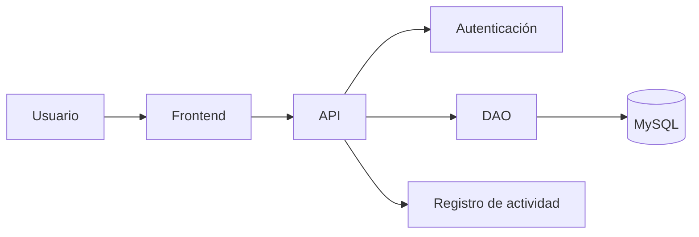

# TaskFlow 

## Tabla de Contenidos:
-[Descripción](#descripción) \
-[Funcionalidades](#funcionalidades) \
-[Badges](#badges) \
-[Instalación](#instalación) \
-[Capturas](#capturas-de-pantallas) \
-[Tecnologías](#tecnologias) \
-[Uso](#uso) \
-[Requisito](#requisitos) \
-[Contribuidores](#contribuidores) \
-[CheckList](#una-checklist-de-funcionalidades)
-[Arquitectura](#arquitectura)

## Descripción
Aplicación para administrar tareas en equipo. Puedes hacer apuntes de las reuniones, he incluso programarlas en la misma aplicación de TaskFlow. Este Software tiene diversos usos y es completamente gratuita e intuitiva. 

## Funcionalidades.
- Organiza tareas en equipo.
- Reúnete con tu equipo.
- Planea tus tareas.
- Acelera el trabajo en equipo.

## Badges
 \
 \

## Instalación
1. Clonar el repositorio.
2. Configurar la base de datos.
3. Configurar las variables necesarias.
4. Ejecutar la aplicación.

## Capturas de pantallas.

### Pantalla Principal

### Pantalla de registro o inicio de sesión.

### Pantalla principal de la funcionalidad

### Calendario del Software
1

## Tecnologias.
- Python
- JAVA
- Html

## Uso
- Agenda tus tareas
- Conversa con tu equipo.
- Planea tu siguiente paso.

## Requisitos.
- 1 GB de espacio.
- 16 GB de RAM.
- Windows 11
- Conección a Internet.

## Una Checklist de funcionalidades.
- [x] Registrar Tareas.
- [x] Editar Tareas.
- [ ] Eliminar Taras
- [ ] Asignar tareas a usuarios.

## Arquitectura

La aplicación esta hecha de diversos elementos. Todos estos en conjunto permiten la funcionalidad correcta del Software presentado. A continuación se describirá un poco de este:

## Contribuidores
- Jairo
- Daniel
- Jose
- Miguel
